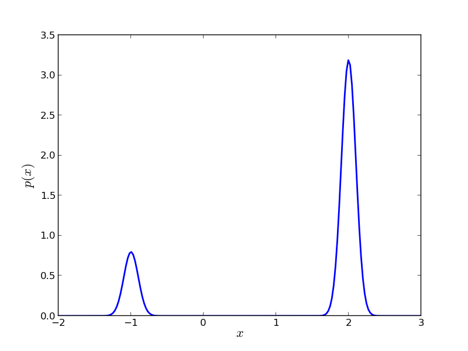
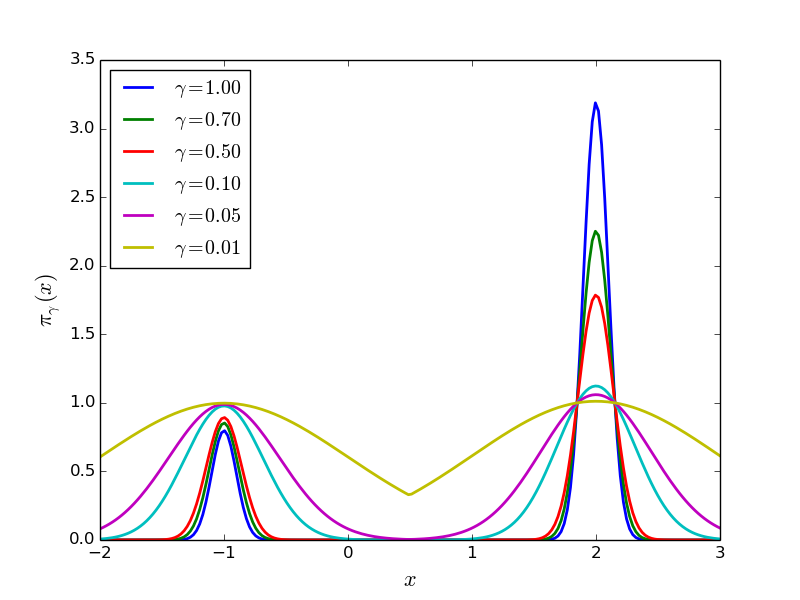
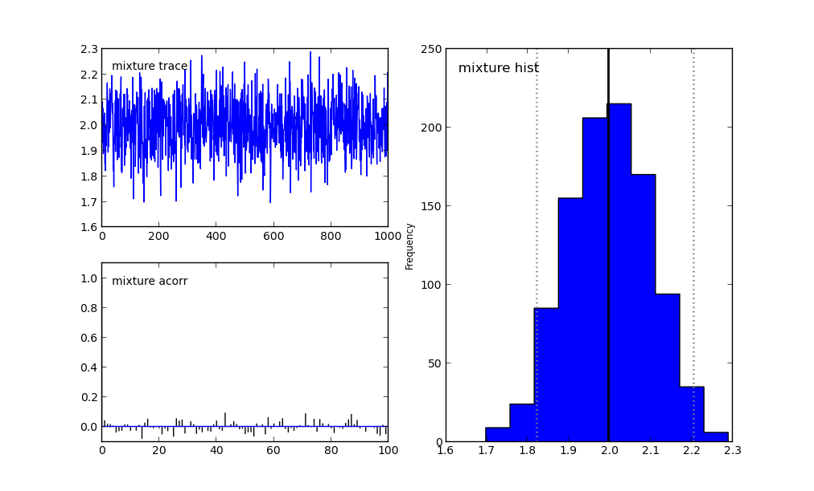
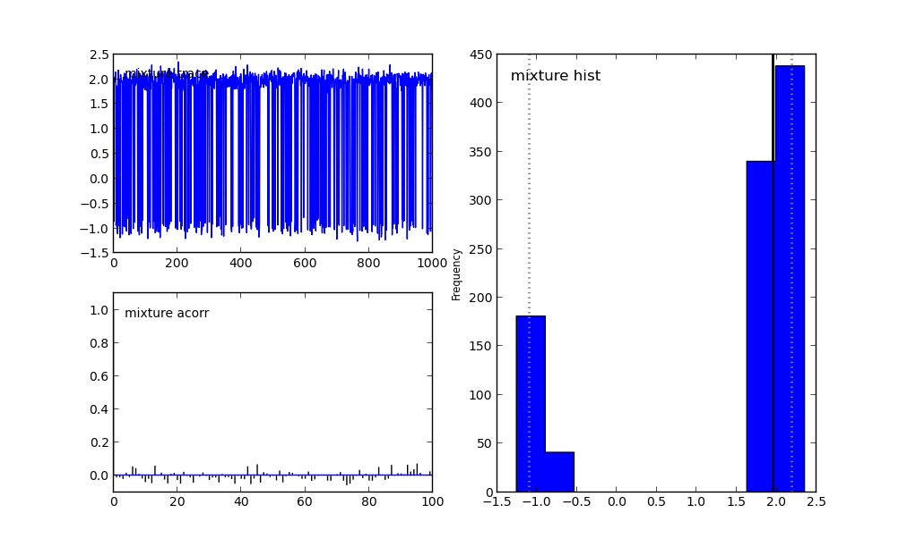

.. _tutorial:

========
Tutorial
========

Before moving forward, make sure you understand:

    + What is probability? That's a big question... If you feel like it,
      I suggest you skim through `E. T. Jaynes`_'s book
      `Probability Theory: The Logic of Science`_.
    + What is `MCMC`_?
    + Read the tutorial of `PyMC`_.
      To the very least, you need to be able to construct probabilistic
      models using this package. For advanced applications, you need to be
      able to construct your own `MCMC step methods`_.
    + Of course, I have to assume some familiarity with the so called
      Sequential Monte Carlo (SMC) or Particle Methods. Many resources can
      be found online at `Arnaud Doucet's collection`_ or in his book
      `Sequential Monte Carlo Methods in Practice`_. What exactly :mod:`pysmc`
      does is documented in :ref:`math`.

.. _what is smc:

-------------------------------
What is Sequential Monte Carlo?
-------------------------------

Sequential Monte Carlo (SMC) is a very efficient and effective way to sample
from complicated probability distributions known up to a normalizing constant.
The most important complicating factor is multi-modality. That is, probability
distributions that do not look at all like Gaussians.

The complete details can be found in :ref:`math`. However, let us give some
insights on what is really going on. Assume that we want so sample
from a probability distribution :math:`p(x)`, known up to a normalizing
constant:

.. math::

    p(x) \propto \pi(x).

Normally, we construct a variant of `MCMC`_ to sample from this
distribution. If :math:`p(x)` is multi-modal, it is certain that the Markov
Chain will get attracted to one of the modes. Theoretically, if the modes are
connected, it is guaranteed that they will all be visited
*as the number of MCMC steps goes to infinity*. However, depending on the
probability of the paths that connect the modes, the chain might
never escape during the finite number of MCMC steps that we can actually afford
to perform.

SMC attempts to alleviate this problem. The way it does it is similar to the
ideas found in `Simulated Annealing`_. The user defines a family of probability
densities:

.. math::
    p_{i}(x) \propto \pi_{i}(x),\;i=1,\dots,n,
    :label: smc_sequence

such that:

+ it is easy to sample from :math:`p_0(x)` (either directly or using MCMC),
+ the probability densities :math:`p_i(x)` and :math:`p_{i+1}(x)` are
  *similar*,
+ the last probability density of the sequence is the target, i.e.,
  :math:`p_n(x) = p(x)`.

There are many ways to define such a sequence. Usually, the exact sequence that
needs to be followed is obvious from the definition of the problem. An obvious
choice is:

.. math::
    p_i(x) \propto \pi^{\gamma_i}(x),\;i=1,\dots,n,
    :label: smc_sequence_power

where :math:`\gamma_0` is a non-negative number that makes :math:`p_i(x)` look
flat (e.g., if :math:`p(x)` has a compact support, you may choose
:math:`\gamma_0=0` which makes :math:`p_0(x)` the uniform density. For
the general case a choice like :math:`\gamma_0=10^{-3}` would still do a good
job) and :math:`\gamma_n=1`. If :math:`n` is chosen sufficiently large and
:math:`gamma_i < \gamma_{i+1}` then indeed :math:`p_i(x)` and :math:`p_{i+1}(x)`
will look similar.

Now we are in a position to discuss what SMC does. We represent each one of the
probability densities :math:`p_i(x)`
:eq:`smc_sequence` with a *particle approximation*
:math:`\left\{\left(w^{(j)_i}, x^{(j)_i}\right)\right\}_{j=1}^N`, where:

+ :math:`N` is known as the *number of particles*,
+ :math:`w^{(j)}_i` is known as the *weight* of particle :math:`j`
  (normalized so that :math:`\sum_{j=1}^Nw^{(j)}_i=1`),
+ :math:`x^{(j)}_i` is known as the *particle* :math:`j`.

Typically we write:

.. math::
    p_i(x) \approx \sum_{j=1}^Nw^{(j)}_i\delta\left(x - x^{(j)}_i\right),
    :label: smc_approx

but what we really mean is that for any measurable
function of the state space :math:`f(x)` the following holds:

.. math::
    \lim_{N\rightarrow\infty}\sum_{j=1}^Nw_i^{(j)}f\left(x^{(j)}_i\right) = \
    \int f(x) p_i(x)dx,
    :label: smc_approx_def

almost surely.

So far so good. The only issue here is actually constructing a particle
approximation satisfying :eq:`smc_approx_def`. This is a little bit involved
and thus described in :ref:`math`. Here it suffices to say that it more or less
goes like this:

1. Start with :math:`i=0` (i.e., the easy to sample distribution).
2. Sample :math:`x_0^{(j)}` from :math:`p_0(x)` either directly (if possible) or
   using MCMC and set the weights equal to :math:`w_0^{(j)} = 1 / N`. Then
   :eq:`smc_approx_def` is satisfied for :math:`i=0`.
3. Compute the weights :math:`w_{i+1}(j)` and sample -using an appropriate MCMC
   kernel- the particles of the next step :math:`x_i^{(j+1)}` so that they
   corresponding particle approximation satisfies :eq:`smc_approx_def`.
4. Set :math:`i=i+1`.
5. If :math:`i=n` stop. Otherwise go to 3.

.. _what is in pysmc:

------------------------------------
What is implemented in :mod:`pysmc`?
------------------------------------

:mod:`pysmc` implements something a little bit more complicated than what is
described in :ref:`what is smc`. The full description can be found in
:ref:`math`. Basically, we assume that the user has defined a one-parameter
family of probability densities:

.. math::
    p_{\gamma}(x) \propto \pi_{\gamma}(x).
    :label: p_gamma

The code must be initialized with a particle approximation at a desired value
of :math:`\gamma=\gamma_0`. This can be done either manually by the user or
automatically by :mod:`pysmc` (e.g. by direct sampling or MCMC).
Having constructed an initial particle approximation, the code can be instructed
to move it to another :math:`\gamma=\gamma_1`. If the two probability densities
:math:`p_{\gamma_0}(x)` and :math:`p_{\gamma_1}(x)` are close, then the code
will jump directly into the construction of the particle approximation at
:math:`\gamma=\gamma_1`. If not, then it will adaptively construct a finite
sequence of :math:`\gamma`'s connecting :math:`\gamma_0` and :math:`\gamma_1`
and jump from one to the other. Therefore, the user only needs to specify:

+ the initial, easy-to-sample-from probability density,
+ the target density,
+ a one-parametric family of densities that connect the two.

We will see how this can be achieved through a bunch of examples.

.. _simple example:

----------------
A Simple Example
----------------

We will start with a probability density with two modes, namely a mixture of
two normal densities:

.. math::
    p(x) = \pi_1 \mathcal{N}\left(x | \mu_1, \sigma_1^2 \right) + \
           \pi_2 \mathcal{N}\left(x | \mu_2, \sigma_2^2 \right),
    :label: simple_model_pdf

where :math:`\mathcal{N}(x|\mu, \sigma^2)` denotes the probability density of a
normal random variable with mean :math:`\mu` and variance :math:`\sigma^2`.
:math:`\pi_i>0` is the weight given to the :math:`i`-th normal
(:math:`\pi_1 + \pi_2 = 1`) and :math:`\mu_i, \sigma_i^2` are the corresponding
mean and variance. We pick the following parameters:

+ :math:`\pi_1=0.2, \mu_1=-1, \sigma_1=0.01`,
+ :math:`\pi_2=0.8, \mu_2=2, \sigma_2=0.01`.

This probability density is shown in `Simple Example PDF Figure`_. It is obvious
that sampling this probability density using MCMC will be very problematic.

.. _Simple Example PDF Figure:

    Plot of :eq:`simple_model_pdf` with
    :math:`\pi_1=0.2, \mu_1=-1, \sigma_1=0.01` and
    :math:`\pi_2=0.8, \mu_2=2, \sigma_2=0.01`.

.. _simple example pdf family:

++++++++++++++++++++++++++++++++++++++++++++++++++
Defining a family of probability densities for SMC
++++++++++++++++++++++++++++++++++++++++++++++++++

Remember that our goal is to sample :eq:`simple_model_pdf` using SMC. Towards
this goal we need to define a one-parameter family of probability densities
:eq:`p_gamma` starting from a simple one to our target. The simplest choice
is probably this:

.. math::
    \pi_{\gamma}(x) = p^{\gamma}(x).
    :label: simple_model_pdf_family

Notice that: 1) for :math:`\gamma=1` we obtain :math:`p_\gamma(x)` and 2) for
:math:`\gamma` small (say :math:`\gamma=10^{-2}`) we obtain a relatively flat
probability density. See `Simple Example Family of PDF's Figure`_.

.. _Simple Example Family of PDF's Figure:

    Plot of :math:`\pi_\gamma(x)` of :eq:`simple_model_pdf_family` for
    various :math:`\gamma`'s.

.. _simple example model:

++++++++++++++++++++++++
Defining a `PyMC`_ model
++++++++++++++++++++++++

Since, this is our very first example we will use it as an opportunity to show
how `PyMC`_ can be used to define probabilistic models as well as MCMC sampling
algorithms. First of all let us mention that a `PyMC` model has to be packaged
either in a class or in a module. For the simple example we are considering, we
choose to use the module approach (see
:download:`examples/simple_model.py <../../examples/simple_model.py>`).
The model can be trivially defined using `PyMC` decorators. All we
have to do is define the logarithm of :math:`\pi_{\gamma}(x)`. We will call it
``mixture``. The contents of that module are:

.. code-block:: python
    :linenos:
    :emphasize-lines: 6,7

    import pymc
    import numpy as np
    import math

    @pymc.stochastic(dtype=float)
    def mixture(value=1., gamma=1., pi=[0.2, 0.8], mu=[-1., 2.],
            sigma=[0.01, 0.01]):
        """
        The log probability of a mixture of normal densities.

        :param value:       The point of evaluation.
        :type value :       float
        :param gamma:       The parameter characterizing the SMC one-parameter
                            family.
        :type gamma :       float
        :param pi   :       The weights of the components.
        :type pi    :       1D :class:`numpy.ndarray`
        :param mu   :       The mean of each component.
        :type mu    :       1D :class:`numpy.ndarray`
        :param sigma:       The standard deviation of each component.
        :type sigma :       1D :class:`numpy.ndarray`
        """
        # Make sure everything is a numpy array
        pi = np.array(pi)
        mu = np.array(mu)
        sigma = np.array(sigma)
        # The number of components in the mixture
        n = pi.shape[0]
        # pymc.normal_like requires the precision not the variance:
        tau = np.sqrt(1. / sigma ** 2)
        # The following looks a little bit awkward because of the need for
        # numerical stability:
        p = np.log(pi)
        p += np.array([pymc.normal_like(value, mu[i], tau[i])
                          for i in range(n)])
        p = math.fsum(np.exp(p))
        # logp should never be negative, but it can be zero...
        if p <= 0.:
            return -np.inf
        return gamma * math.log(p)

This might look a little bit complicated but unfortunately one has to take care
of round-off errors when sump small numbers...
Notice that, we have defined pretty much every part of the mixture as an
independent variable. The essential variable that defines the family of
:eq:`simple_model_pdf_family` is ``gamma``. Well, you don't actually have to
call it ``gamma``, but we will talk about this later...

Let's import that module and see what we can do with it::

    >>> import simple_model as model
    >>> print model.mixture.parents
    {'mu': [-1.0, 2.0], 'pi': [0.2, 0.8], 'sigma': [0.01, 0.01], 'gamma': 1.0}

The final command shows you all the parents of the stochastic variable
``mixture``.
The stochastic variable mixture was assigned a value by default (see line 4
at the code block above). You can see the current value of the stochastic
variable at any time by doing::

    >>> print model.mixture.value
    1.0

If we started a `MCMC` chain at this point, this would be the initial value of
the chain. You can change it to anything you want by simply doing::

    >>> model.mixture.value = 0.5
    >>> print model.mixture.value
    0.5

To see the logarithm of the probability at the current state of the stochastic
variable, do::

    >>> print model.mixture.logp
    -111.11635344

Now, if you want to change, let's say, ``gamma`` to ``0.5`` all
you have to do is::

    >>> model.mixture.parents['gamma'] = 0.5
    >>> print model.mixture.gamma
    0.5

The logarithm of the probability should have changed also::

    >>> print model.mixture.logp
    -55.5581767201

.. _mcmc_attempt:

++++++++++++++++++++++++
Attempting to do `MCMC`_
++++++++++++++++++++++++

Let's load the model again and attempt to do `MCMC`_ using `PyMC`_'s
functionality::

    >>> import simple_model as model
    >>> import pymc
    >>> mcmc_sampler = pymc.MCMC(model)
    >>> mcmc_sampler.sample(1000000, thin=1000, burn=1000)

You should see a progress bar measuring the number of samples taken. It should
take about a minute to finish. We are actually doing :math:`10^6` `MCMC`_ steps,
we burn the first ``burn = 1000`` samples and we are looking at the chain
every ``thin = 1000`` samples (i.e., we are dropping everything in between).
`PyMC`_ automatically picks a proposal (see `MCMC step methods`_) for you. For
this particular example it should have picked
:class:`pymc.step_methods.Metropolis` which corresponds to a simple random walk
proposal. There is no need to tune the parameters of the random walk since
`PyMC`_ is supposed to do that for you. In any case, it is possible to find the
right variance for the random walk, but you need to know exactly how far apart
the modes are...

You may look at the samples we've got by doing::

    >>> print mcmc_sampler.trace('mixture')[:]
    [ 1.9915846   1.93300521  2.09291872  2.05159841  2.06620882  1.88901709
      1.89521431  1.9631256   2.0363258   1.9756637   2.04818845  1.85036634
      1.98907666  1.82212356  1.97678175  1.99854311  1.92124829  2.02077581
      2.08536334  2.16664208  2.08328293  2.05378638  1.89437676  2.09555348
    ...

Now, let us plot the results::

    >>> import matplotlib.pyplot as plt
    >>> pymc.plot(mcmc_sampler)
    >>> plt.show()

The results are shown in `Simple Example MCMC Figure`_. Unless, you are
extremely lucky, you should have missed one of the modes...

.. _Simple Example MCMC Figure:

    MCMC fails to capture one of the modes of :eq:`simple_model_pdf`.

Now, let's see what it takes to make it work. Basically, what we need to
do is find the right step for the random walk proposal. Looking at
`Simple Example Family of PDF's Figure`_, it is easy to guess that the
right step is :math:`3`. So, let's try this::

    >>> import simple_model as model
    >>> import pymc
    >>> mcmc_sampler = pymc.MCMC(simple_model)
    >>> proposal = pymc.Metropolis(model.mixture, proposal_sd=3.)
    >>> mcmc_sampler.step_method_dict[model.mixture][0] = proposal
    >>> mcmc_sampler.sample(1000000, thin=1000, burn=0,
                           tune_throughout=False)

For more details on selecting/tuning step methods see
`MCMC step methods`_. In the last line we have asked `PyMC`_ not to tune
the parameters of the step method. If we didn't do that, it would be
fooled again. The results are shown in
`Simple Example MCMC Picked Proposal Figure`_.

.. _Simple Example MCMC Picked Proposal Figure:

    Multi-modal distributions can be captured by simple `MCMC`_ only if
    you have significant prior knowledge about them.

You see that the two modes can be captured by plain `MCMC`_ if we
actually know how far appart they are. Of course, this is completely
useless in a real problem. Most of the times, we are not be able to
draw the probability density function and see where the modes are.
SMC is here to save the day!

.. _smc_attempt:

+++++++++
Doing SMC
+++++++++

To finish this example, let's just see how SMC behaves. As we mentioned
earlier, SMC requires:

+ a one-parameter family of probability densities connecting a simple
  probability density to our target (we created this in
  :ref:`simple_example_model`), and
+ an `MCMC` sampler (we saw how to create one in :ref:`mcmc_attempt`).

Now, let's put everything together using the functionality of
:class:`pysmc.SMC`:

.. code-block:: python
    :linenos:

    import simple_model as model
    import pymc
    import pysmc

    # Construct the MCMC sampler
    mcmc_sampler = pymc.MCMC(model)
    # Construct the SMC sampler
    smc_sampler = pysmc.SMC(mcmc_sampler, num_particles=1000,
                            num_mcmc=10, verbose=1)
    # Initialize SMC at gamma = 0.01
    smc_sampler.initialize(0.01)
    # Move the particles to gamma = 1.0
    smc_sampler.move_to(1.0)
    # Get a particle approximation
    p = smc_sampler.get_particle_approximation()
    # Plot a histogram
    pysmc.hist(p, 'mixture')
    plt.show()

This code can be found in
:download:`examples/simple_model_run.py <../../examples/simple_model_run.py>`.

In lines 8-9, we initialize the SMC class. Of course, it requires a
``mcmc_sampler`` which is a :class:`pymc.MCMC` object.
``num_particles`` specifies the number of particles we wish to use and
``num_mcmc`` the number of `MCMC`_ steps we are going to perform at each
different value of :math:`\gamma`. The ``verbose`` parameter specifies
the amount of text the algorithm prints to the standard output.
There are many more parameters which are fully documented in
:class:`pysmc.SMC`. In line 11, we initialize the algorithm at
:math:`\gamma=10^{-2}`. This essentially performs a number of `MCMC`_
steps at this easy-to-sample-from probability density. It constructs the
initialial particle approximation. See
:meth:`pysmc.SMC.initialize()` the complete list of arguments.
In line 13, we instruct the object to move the particle
approximation to :math:`\gamma=1`, i.e., to the target probability
density of this particular example. To see the weights of the final
particle approximation, we use :attr:`pysmc.SMC.weights`
(e.g., ``smc_sampler.weights``). To get the particles themselves we may
use :attr:`pysmc.SMC.particles` (e.g., ``smc_sampler.particles``) which
returns a dictionary of the particles. However, it is usually most
convenient to access them via :meth:`pysmc.SMC.get_particle_approximation()`
which returns a :class:`pysmc.ParticleApproximation` object.

The output of the algorithm looks like this::

    ------------------------
    START SMC Initialization
    ------------------------
    - initializing at gamma : 0.01
    - initializing by sampling from the prior: FAILURE
    - initializing via MCMC
    - taking a total of 10000
    - creating a particle every 10
    [---------------- 43%                  ] 4392 of 10000 complete in 0.5 sec
    [-----------------83%-----------       ] 8322 of 10000 complete in 1.0 sec
    ----------------------
    END SMC Initialization
    ----------------------
    -----------------
    START SMC MOVE TO
    -----------------
    initial  gamma : 0.01
    final gamma : 1.0
    ess reduction:  0.9
    - moving to gamma : 0.0204271802459
    - performing 10 MCMC steps per particle
    [------------     31%                  ] 3182 of 10000 complete in 0.5 sec
    [-----------------62%---               ] 6292 of 10000 complete in 1.0 sec
    [-----------------93%---------------   ] 9322 of 10000 complete in 1.5 sec
    - moving to gamma : 0.0382316662144
    - performing 10 MCMC steps per particle
    [----------       28%                  ] 2822 of 10000 complete in 0.5 sec
    [-----------------55%-                 ] 5542 of 10000 complete in 1.0 sec
    [-----------------81%-----------       ] 8162 of 10000 complete in 1.5 sec
    - moving to gamma : 0.0677677161458
    - performing 10 MCMC steps per particle
    [---------        24%                  ] 2442 of 10000 complete in 0.5 sec
    [-----------------47%                  ] 4732 of 10000 complete in 1.0 sec
    [-----------------70%------            ] 7032 of 10000 complete in 1.5 sec
    [-----------------91%--------------    ] 9172 of 10000 complete in 2.0 sec
    - moving to gamma : 0.118156872826
    - performing 10 MCMC steps per particle
    [--------         21%                  ] 2122 of 10000 complete in 0.5 sec
    [---------------  42%                  ] 4202 of 10000 complete in 1.0 sec
    [-----------------62%---               ] 6232 of 10000 complete in 1.5 sec
    [-----------------81%-----------       ] 8172 of 10000 complete in 2.0 sec
    - moving to gamma : 0.206496296978
    - performing 10 MCMC steps per particle
    [-----            15%                  ] 1502 of 10000 complete in 0.5 sec
    [------------     33%                  ] 3332 of 10000 complete in 1.0 sec
    [-----------------48%                  ] 4882 of 10000 complete in 1.5 sec
    [-----------------66%-----             ] 6602 of 10000 complete in 2.0 sec
    [-----------------82%-----------       ] 8252 of 10000 complete in 2.5 sec
    [-----------------96%----------------  ] 9692 of 10000 complete in 3.0 sec
    - moving to gamma : 0.326593174468
    - performing 10 MCMC steps per particle
    [------           16%                  ] 1642 of 10000 complete in 0.5 sec
    [------------     32%                  ] 3252 of 10000 complete in 1.0 sec
    [-----------------48%                  ] 4842 of 10000 complete in 1.5 sec
    [-----------------64%----              ] 6412 of 10000 complete in 2.0 sec
    [-----------------79%----------        ] 7942 of 10000 complete in 2.5 sec
    [-----------------94%---------------   ] 9432 of 10000 complete in 3.0 sec
    - moving to gamma : 0.494246909688
    - performing 10 MCMC steps per particle
    [-----            14%                  ] 1402 of 10000 complete in 0.5 sec
    [----------       28%                  ] 2832 of 10000 complete in 1.0 sec
    [---------------- 42%                  ] 4232 of 10000 complete in 1.5 sec
    [-----------------56%-                 ] 5622 of 10000 complete in 2.0 sec
    [-----------------69%------            ] 6992 of 10000 complete in 2.5 sec
    [-----------------83%-----------       ] 8342 of 10000 complete in 3.0 sec
    [-----------------96%----------------  ] 9662 of 10000 complete in 3.5 sec
    - moving to gamma : 0.680964613537
    - performing 10 MCMC steps per particle
    [----             13%                  ] 1302 of 10000 complete in 0.5 sec
    [---------        25%                  ] 2552 of 10000 complete in 1.0 sec
    [--------------   38%                  ] 3832 of 10000 complete in 1.5 sec
    [-----------------50%                  ] 5032 of 10000 complete in 2.0 sec
    [-----------------62%---               ] 6272 of 10000 complete in 2.5 sec
    [-----------------75%--------          ] 7502 of 10000 complete in 3.0 sec
    [-----------------86%------------      ] 8672 of 10000 complete in 3.5 sec
    [-----------------98%----------------- ] 9842 of 10000 complete in 4.0 sec
    - moving to gamma : 1.0
    - performing 10 MCMC steps per particle
    [----             11%                  ] 1172 of 10000 complete in 0.5 sec
    [--------         23%                  ] 2302 of 10000 complete in 1.0 sec
    [------------     34%                  ] 3412 of 10000 complete in 1.5 sec
    [-----------------44%                  ] 4482 of 10000 complete in 2.0 sec
    [-----------------55%-                 ] 5582 of 10000 complete in 2.5 sec
    [-----------------67%-----             ] 6702 of 10000 complete in 3.0 sec
    [-----------------77%---------         ] 7792 of 10000 complete in 3.5 sec
    [-----------------88%-------------     ] 8892 of 10000 complete in 4.0 sec
    [-----------------99%----------------- ] 9972 of 10000 complete in 4.5 sec
    ---------------
    END SMC MOVE TO
    ---------------

The figure you should see is shown in
`Simple Example SMC Histogram Figure`_. You see that SMC has no problem
discovering the two modes, even though we have not hand-picked the
parameters of the `MCMC`_ proposal.

.. _Simple Example SMC Histogram Figure:
.. figure:: images/simple_model_smc.png
    :align: center

    SMC easily discovers both modes of :eq:`simple_model_pdf`

.. _smc_without_mcmc:

++++++++++++++++++++++++++++++++++++
Initializing SMC with just the model
++++++++++++++++++++++++++++++++++++

It is also possible to initialize SMC without explicitly specifying a
:class:`pymc.MCMC`. This allows `PyMC`_ to select everything for you.
It can be done like this:

.. code-block:: python
    :linenos:

    import simple_model as model
    import pysmc

    # Construct the SMC sampler
    smc_sampler = pysmc.SMC(model, num_particles=1000,
                            num_mcmc=10, verbose=1)
    # Do whatever you want to smc_sampler...

.. _database:

++++++++++++++++++++++++++++++
Dumping the data to a database
++++++++++++++++++++++++++++++

At the moment we support only a very simple database (see
:class:`pysmc.DataBase`) which is built on :mod:`cPickle`. There are two
options of :class:`pysmc.SMC` that you need to specify when you want to use
the database functionality: ``db_filename`` and ``update_db``. See the
documentation of :class:`pysmc.SMC` for their complete details. If you are
using a database, you can force the current state of SMC to be written to
it by calling :meth:`pysmc.commit()`. If you want to access a database,
the all you have to do is use the attribute :attr:`pysmc.db`.
Here is a very simple illustration of what you can do with this:

.. code-block:: python
    :linenos:

    import simple_model as model
    import pysmc

    smc_sampler = pysmc.SMC(model, num_particles=1000,
                            num_mcmc=10, verbose=1,
                            db_filename='db.pickle',
                            update_db=True)
    smc_sampler.initialize(0.01)
    smc_sampler.move(0.5)

As you have probably grasped until now, this will construct an initial
particle approximation at :math:`\gamma=0.01` and it will move it to
:math:`\gamma=0.5`. The ``db_filename`` option specifies the file on which
the database will write data. Let us assume that the file does not exist.
Then, it will be created. The option ``update_db`` specifies that SMC should
commit data to the database everytime it moves to another :math:`\gamma`.
Now, assume that you quit python. The database is saved in ``db.pickle``.
If you want to continue from the point you had stopped, all you have to do
is:

.. code-block:: python
    :linenos:

    import simple_model as model
    import pysmc

    smc_sampler = pysmc.SMC(model, num_particles=1000,
                            num_mcmc=10, verbose=1,
                            db_filename='db.pickle',
                            update_db=True)
    smc_sampler.move(1.)

Now, we have just skipped the initialization line. Sine the database already
exists, :class:`pysmc.SMC` looks at it and initializes the particle
approximation from the last state stored in it. Therefore, you actually
start moving from :math:`\gamma=0.5` to :math:`\gamma=1`.

.. _db_movie:

+++++++++++++++++++++++++++++++
Making a movie of the particles
+++++++++++++++++++++++++++++++

If you have stored the particle approximations of the various 
:math:`\gamma`'s in a database, then it is possible to make a movie out of
them using :func:`pysmc.make_movie_from_db()`. Here is how:

.. code-block:: python
    :linenos:

    import pysmc
    import matplotlib.pyplot as plt

    # Load the database
    db = pysmc.DataBase.load('db.pickle')
    # Make the movie
    movie = make_movie_from_db(db, 'mixture')
    # See the movie
    plt.show()
    # Save the movie
    movie.save('smc_movie.mp4')

The movie created in this way can be downloaded from
:download:`videos/smc_movie.mp4`.

.. _parallel_sampling:

--------------------
Sampling in Parallel
--------------------

With :mod:`pysmc` it is possible to carry out the sampling procedure in
parallel. As is well known, SMC is embarransingly parallelizable. Taking it to
the extreme, its process has to deal with only one particle. Communication is
only necessary when there is a need to resample the particle approximation
and for finding the next :math:`\gamma` in the sequence of probability
densities. Parallelization in :mod:`pysmc` is achieved with the help of
`mpi4py <http://mpi4py.scipy.org/>`_. Here is a simple example:

.. code-block:: python
    :linenos:
    :emphasize-lines: 3, 9, 18, 19

    import pysmc
    import simple_model as model
    import mpi4py.MPI as mpi
    import matplotlib.pyplot as plt

    # Construct the SMC sampler
    smc_sampler = pysmc.SMC(model, num_particles=1000,
                            num_mcmc=10, verbose=1,
                            mpi=mpi, gamma_is_an_exponent=True)
    # Initialize SMC at gamma = 0.01
    smc_sampler.initialize(0.01)
    # Move the particles to gamma = 1.0
    smc_sampler.move_to(1.)
    # Get a particle approximation
    p = smc_sampler.get_particle_approximation()
    # Plot a histogram
    pysmc.hist(p, 'mixture')
    if mpi.COMM_WORLD.Get_rank() == 0:
        plt.show()

As you can see the only difference is at line 3 where :mod:`mpi4py` is 
instantiated, line 8 where mpi is passed as an argument to :class:`pysmc.SMC`
and the last two lines where we simply specify that only one process should
attempt to plot the histogram. 

.. _E. T. Jaynes:
    E. T. Jaynes' http://en.wikipedia.org/wiki/Edwin_Thompson_Jaynes>
.. _Probability Theory\: The Logic of Science:
    http://omega.albany.edu:8008/JaynesBook.html
.. _MCMC:
    http://en.wikipedia.org/wiki/Markov_chain_Monte_Carlo
.. _PyMC:
    http://pymc-devs.github.io/pymc/
.. _MCMC step methods:
    http://pymc-devs.github.io/pymc/extending.html#user-defined-step-methods
.. _Arnaud Doucet's collection:
    http://www.stats.ox.ac.uk/~doucet/smc_resources.html
.. _Sequential Monte Carlo Methods in Practice:
    http://books.google.com/books/about/Sequential_Monte_Carlo_Methods_in_Practi.html?id=BnWAcgAACAAJ
.. _Simulated Annealing:
    http://en.wikipedia.org/wiki/Simulated_annealing
